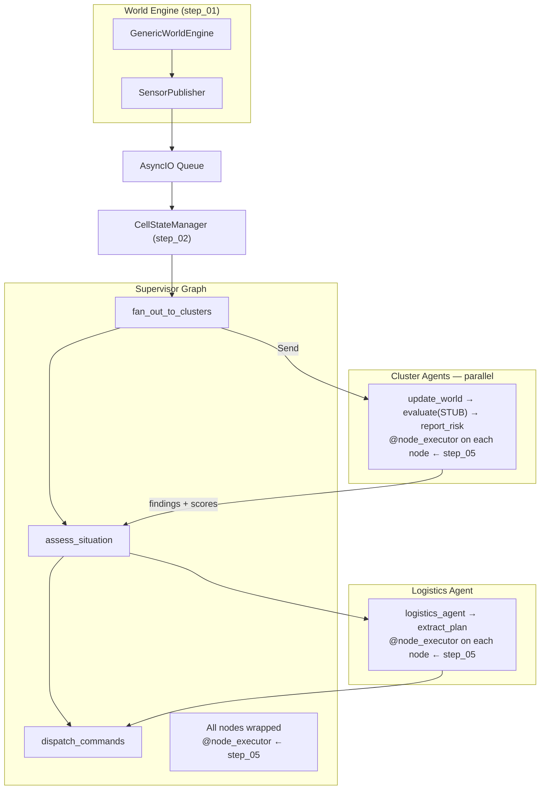

# Wildfire Agentic Advisor — Step 05: Node Executor Decorator

> **Step 5 of 9** — Cross-cutting concerns. Every node in every graph now has metrics, error handling, and tracing without any node writing that logic itself.

## This Step

Step 05 adds the `@node_executor` decorator and applies it to all nodes across the three graphs. No agent logic changes — only the execution framework around each node is new. This is the step where the pipeline goes from "it runs" to "it observes itself."

### What was added

| Module | Purpose |
|--------|---------|
| `src/agents/commons/node_executor.py` | `@node_executor(name)` decorator — wraps sync and async node functions with timing, error capture, and status transitions |
| `src/agents/commons/node_metrics.py` | `NodeMetrics` — per-node counters (calls, errors, total duration); `metrics` singleton accessed from anywhere |
| `src/agents/commons/node_types.py` | `NodeError` — structured error record written to `state.error` on exception |
| `src/agents/commons/routing.py` | Routing helpers — `route_on_status` and similar conditional edge helpers built on `StatusValue` |
| `src/agents/commons/schemas.py` | `TracedState` base class formalised — `session_id`, `status`, `error` fields required by the decorator |
| `src/agents/cluster/nodes.py` | All cluster nodes decorated with `@node_executor` |
| `src/agents/logistics/nodes.py` | All logistics nodes decorated with `@node_executor` |
| `src/agents/supervisor/nodes.py` | All supervisor nodes decorated with `@node_executor` |

### What you can run

```bash
uv run python verify_setup.py
uv run python main.py              # same pipeline — now emits per-node timing and error logs
uv run python -m pytest tests/ -v
```

Behaviour is identical to step 04. The difference is observable: node duration and outcome are logged after every node call, and any unhandled exception inside a node is now caught, structured as a `NodeError`, written to `state.error`, and the graph continues rather than crashing.

### Key design points

- **Both sync and async** — `node_executor` inspects the wrapped function with `asyncio.iscoroutinefunction` and returns either a sync or async wrapper accordingly. LangGraph nodes can be either; the decorator handles both transparently.
- **Error contract** — when a node raises, the decorator sets `state.status = StatusValue.ERROR` and `state.error = NodeError(...)` rather than re-raising. This means downstream nodes can inspect `state.status` and route accordingly. The `route_on_status` helper in `routing.py` turns this into a conditional edge pattern.
- **`NodeMetrics` singleton** — intentionally process-scoped (not per-graph or per-session). In production you would push these to a metrics backend; here they are available for tests to assert on node execution counts and error rates.
- **`TracedState.session_id`** — set by the orchestrator before the first supervisor invocation. The decorator stamps each log line with the session ID, making it possible to trace a single sensor batch through all three graphs in the log output.

---

## Full System Overview



## Step Progression

| Step | What it adds |
|------|--------------|
| 01 | World engine, sensor inventory, publisher, transport queue, store backends |
| 02 | Supervisor graph + orchestrator skeleton |
| 03 | Cluster (risk) agent skeleton + Send API fan-out |
| 04 | Logistics agent skeleton |
| **05** | **`@node_executor` decorator — per-node metrics, structured errors, distributed tracing** |
| 06 | Jinja2 prompt registry |
| 07 | LLM registry + cluster agent live |
| 08 | Logistics tools + logistics agent live |
| 09 | Advisory dispatch completed — full pipeline operational |
