# Wildfire Agentic Advisor — Step 07: LLM Registry + Cluster Agent Live

> **Step 7 of 9** — First real LLM calls. The cluster agent's `evaluate` node now produces genuine risk assessments.

## This Step

Step 07 introduces the `LLMRegistry` — a role-based router that maps named roles (`"classifier"`, `"supervisor"`, etc.) to a provider + model configuration — and uses it to make the cluster agent's `evaluate` node live. For the first time, each cluster agent calls an LLM with structured output and returns real `CollatedRecordRisk` scores instead of stubs.

### What was added

| Module | Purpose |
|--------|---------|
| `src/llm/llm_registry.py` | `LLMRegistry` — maps role names to `LLMProvider` × `LLMLabel`; instantiates LangChain chat models; supports STUB / OpenAI / Anthropic / Ollama providers |
| `src/llm/token_callback.py` | `TokenUsageCallback` — LangChain callback that accumulates token counts per session for cost tracking |
| `src/config.py` | Extended with `LLM_ROLE_CONFIG`, `build_llm_registry()`, and provider credential loading |
| `src/agents/commons/agent_dependencies.py` | `LLMRegistry` added to `AgentDependencies` |
| `src/agents/cluster/nodes.py` | `evaluate` node goes live — calls `registry.get("classifier")`, invokes with structured output schema, writes real `CollatedRecordRisk` objects |
| `src/agents/cluster/graph.py` | Updated to thread `AgentDependencies` into `evaluate` |
| `src/agents/supervisor/nodes.py` | `assess_situation` updated to summarise real scores from cluster findings |
| `src/agents/logistics/graph.py` | Updated to receive `AgentDependencies` (registry now available, not yet used) |

### What you can run

```bash
uv run python verify_api_key.py           # confirm your API key is set
uv run python verify_llm_registry.py      # confirm role → model mapping resolves
uv run python main.py                     # live cluster risk assessments
uv run python -m pytest tests/ -v
```

To run without an API key, set the provider to `STUB` in your `.env` or environment. The stub provider returns deterministic responses using the same structured output schema — useful for CI.

### Configuring the LLM

Set these environment variables (or add them to a `.env` file):

```bash
AI_LLM_PROVIDER=ANTHROPIC          # STUB | OPENAI | ANTHROPIC | OLLAMA
AI_ANTHROPIC_API_KEY=sk-ant-...    # or AI_OPENAI_API_KEY / AI_OLLAMA_BASE_URL
AI_CLASSIFIER_MODEL=haiku           # haiku | sonnet
```

### Key design points

- **Role-based routing** — nodes request an LLM by role name (`registry.get("classifier")`), not by model string. Swapping the model behind a role is a config change, not a code change. This also makes it straightforward to run cheaper models for high-frequency roles (cluster evaluation runs once per cluster per tick) and more capable models for lower-frequency roles.
- **Structured output** — `evaluate` uses LangChain's `.with_structured_output(RiskAssessment)` to get a `RiskAssessment` Pydantic object directly from the LLM response, validated on arrival. No string parsing.
- **`TokenUsageCallback`** — attached to each LLM invocation. Logs prompt and completion token counts per session. Useful for cost estimation across a full simulation run.
- **Cluster agents run in parallel** — each cluster agent is its own independent LangGraph subgraph invocation. All `evaluate` LLM calls for a given supervisor tick are in-flight simultaneously. The `merge_cluster_findings` reducer waits for all to complete before `assess_situation` runs.

---

## Full System Overview

```mermaid
flowchart TD
    subgraph World["World Engine (step_01)"]
        WE["GenericWorldEngine"] --> SP["SensorPublisher"]
    end

    SP --> Q["Queue"] --> CM["CellStateManager"] --> SV

    subgraph MAIN["Supervisor Graph"]
        SV["fan_out_to_clusters"] --> AS["assess_situation"] --> DC["dispatch_commands"]
    end

    subgraph CLUSTER["Cluster Agents — parallel (step_03)"]
        UW["update_world"] --> EV["evaluate ← LIVE step_07\nLLM structured output\nCollatedRecordRisk per cell"] --> RR["report_risk"]
    end

    SV -->|Send| UW
    RR -->|"real risk scores"| AS

    subgraph REGISTRY["LLM Registry (step_07) ← YOU ARE HERE"]
        LR["LLMRegistry\nrole → provider · model\nSTUB · OpenAI · Anthropic · Ollama"]
    end

    EV <-->|"registry.get('classifier')"| LR

    AS --> LA

    subgraph LOGISTICS["Logistics Agent"]
        LA["logistics_agent\nSTUB — LLM registry available\nnot yet used"]
    end

    LA --> DC
```



## Step Progression

| Step | What it adds |
|------|--------------|
| 01 | World engine, sensor inventory, publisher, transport queue, store backends |
| 02 | Supervisor graph + orchestrator skeleton |
| 03 | Cluster (risk) agent skeleton + Send API fan-out |
| 04 | Logistics agent skeleton |
| 05 | `@node_executor` decorator — metrics + exception handling |
| 06 | Jinja2 prompt registry |
| **07** | **LLM registry + cluster agent live — real parallel risk assessments per tick** |
| 08 | Logistics tools + logistics agent live |
| 09 | Advisory dispatch completed — full pipeline operational |
