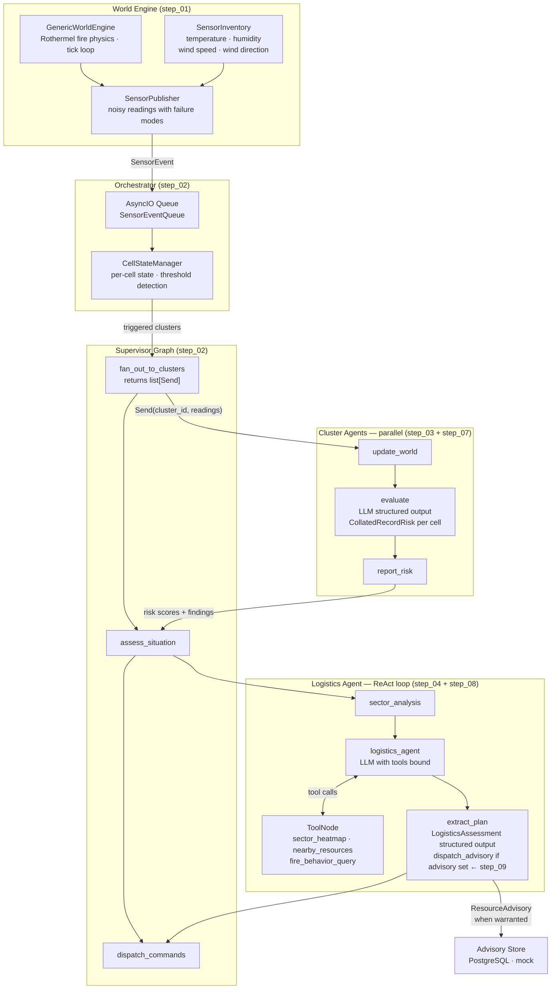
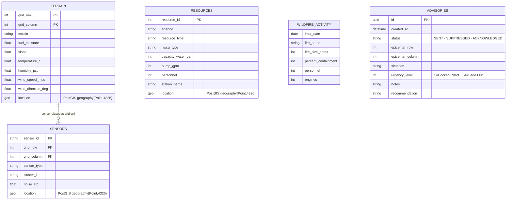

# Wildfire Agentic Advisor — Step 09: Advisory Dispatch (Complete Pipeline)

> **Step 9 of 9** — The full end-to-end system. When conditions warrant, a `ResourceAdvisory` is written to the store.

## This Step

Step 09 closes the loop. The `dispatch_advisory` function is called from `extract_plan` when the logistics agent's assessment includes a `ResourceAdvisory`. The advisory is written to the advisory store (PostgreSQL or mock) and logged to the console. The logistics prompts are also refined in this step based on observed LLM behaviour from step 08.

This is the reference implementation. All agent logic is live, all tools are real, and the full pipeline runs without stubs.

### What was added

| Module | Purpose |
|--------|---------|
| `src/tools/advisory.py` | `dispatch_advisory(advisory, repo)` — writes a `ResourceAdvisory` to the advisory store as a `ResourceAdvisoryRecord`; logs the dispatch event |
| `src/agents/logistics/nodes.py` | `extract_plan` updated — calls `dispatch_advisory` when `logistics_assessment.advisory` is not `None` |
| `src/agents/logistics/graph.py` | `AdvisoryRepository` threaded into `extract_plan` via `AgentDependencies` |
| `src/agents/logistics/state.py` | Minor field updates for the advisory dispatch flow |
| `src/prompts/templates/logistics/v1/prompt.j2` | Prompt refinements — clearer instructions for when to populate `advisory` vs. leave it `None` |
| `src/prompts/templates/logistics_extract/v1/prompt.j2` | Extraction prompt tightened — `advisory_rationale` required even when no advisory is issued |

### What you can run

```bash
uv run python verify_api_key.py
uv run python verify_llm_registry.py
uv run python main.py              # complete pipeline — advisories written when warranted
uv run python -m pytest tests/ -v
```

When the logistics agent determines that conditions warrant a response, you will see:

```
● ADVISORY DISPATCHED  row=4, col=7
```

The `ResourceAdvisory` is persisted to the advisory store and visible via `stores/cli.py` or directly in PostgreSQL if you have it configured.

### Advisory urgency levels

The `ResourceAdvisory.urgency_level` field uses a standard emergency management scale:

| Level | Name | Meaning |
|-------|------|---------|
| 4 | Fade Out | Lowest readiness — routine monitoring |
| 3 | Double Take | Elevated readiness — increased monitoring |
| 2 | Fast Pace | High readiness — prepare for deployment |
| 1 | Cocked Pistol | Maximum readiness — imminent response required |

### Key design points

- **Agent decides; function dispatches** — the LLM decides whether a `ResourceAdvisory` is warranted by populating or leaving null the `advisory` field on `LogisticsAssessment`. The graph code calls `dispatch_advisory` if and only if that field is set. The dispatch function itself is not a tool the LLM calls — it is called deterministically by the `extract_plan` node after the structured output step. This keeps the LLM out of the write path.
- **Idempotent records** — each advisory is assigned a `uuid` on creation. Re-running the pipeline with the same scenario will produce new advisory records rather than updating existing ones. The `status` field (`SENT` / `SUPPRESSED` / `ACKNOWLEDGED`) is intended for downstream acknowledgement workflows.
- **Prompt refinement process** — the prompt changes in this step exist because the step 08 prompts produced `advisory=None` too aggressively (the model was uncertain about populating a structured field). The refined prompts include explicit examples of when to populate `advisory` and a required `advisory_rationale` that forces the model to reason about the decision even when it chooses not to dispatch.

---

## Full System Overview



### Data Model



## Step Progression

| Step | What it adds |
|------|--------------|
| 01 | World engine, sensor inventory, publisher, transport queue, store backends |
| 02 | Supervisor graph + orchestrator skeleton |
| 03 | Cluster (risk) agent skeleton + Send API fan-out |
| 04 | Logistics agent skeleton |
| 05 | `@node_executor` decorator — metrics + exception handling |
| 06 | Jinja2 prompt registry |
| 07 | LLM registry + cluster agent live |
| 08 | Logistics tools + logistics agent live |
| **09** | **Advisory dispatch completed — full end-to-end pipeline operational** |
