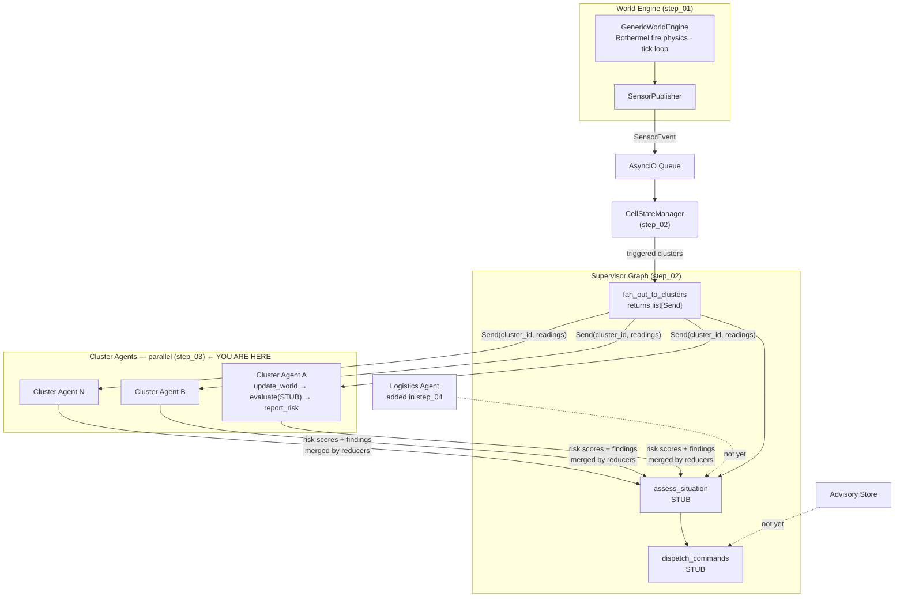

# Wildfire Agentic Advisor — Step 03: Cluster (Risk) Agent Skeleton

> **Step 3 of 9** — The Send API fan-out pattern. The supervisor now spawns parallel cluster subgraphs.

## This Step

Step 03 introduces the cluster (risk) agent as a LangGraph subgraph and wires it into the supervisor via the **Send API**. This is the central multi-agent pattern of the tutorial: `fan_out_to_clusters` returns a `list[Send]`, one per active cluster, and LangGraph runs all of them in parallel. Custom reducers on `SupervisorState` merge the results back as the implicit synchronisation barrier.

The cluster agent's `evaluate` node is still a stub — it returns deterministic placeholder risk scores. The graph topology and data contracts are fully in place.

### What was added

| Module | Purpose |
|--------|---------|
| `src/agents/cluster/graph.py` | `build_cluster_agent_graph()` — compiles the cluster subgraph |
| `src/agents/cluster/state.py` | `ClusterAgentState` — `readings`, `updated_cells`, `risk_assessments`, `messages` |
| `src/agents/cluster/nodes.py` | `update_world` (writes sensor readings to grid cells), `evaluate` (STUB — placeholder scores), `report_risk` (logs assessments) |
| `src/agents/supervisor/graph.py` | Updated to compile cluster subgraph and pass it to `make_run_cluster_agent` |
| `src/agents/supervisor/nodes.py` | `fan_out_to_clusters` now returns real `Send` objects; `run_cluster_agent` invokes the subgraph |
| `src/agents/supervisor/state.py` | Updated with `cluster_score` and `cluster_findings` annotated fields and their reducers |
| `src/transport/` | Added — thin bridge between `SensorEventQueue` wire format and agent `CellReadings` schema |

### What you can run

```bash
uv run python verify_setup.py
uv run python main.py              # pipeline with parallel cluster agents (stub scores)
uv run python -m pytest tests/ -v
```

The pipeline now produces `cluster_score` and `cluster_findings` in supervisor state after each invocation. The scores are deterministic stubs but the graph topology, state reducers, and subgraph invocation are all real.

### Key design points

- **Send API fan-out** — `fan_out_to_clusters` is a conditional edge function (not a node). It iterates `state.clusters`, creates `Send("run_cluster_agent", ClusterAgentState(...))` for each cluster, and returns the list. LangGraph schedules all sends in parallel automatically.
- **Custom reducers as the synchronisation barrier** — `max_cluster_score` and `merge_cluster_findings` are called by LangGraph after each parallel branch completes. The supervisor's `assess_situation` node does not run until all cluster agents have finished and merged.
- **`update_world` node** — this node writes incoming `CellReadings` metric values directly onto the in-memory world grid cells before `evaluate` runs. This keeps the world grid as the single source of truth for cell state throughout the agent's reasoning.
- **Subgraph isolation** — `ClusterAgentState` is entirely separate from `SupervisorState`. The supervisor maps its `clusters[cluster_id]` list into the subgraph's `readings` field on invocation and lifts `risk_assessments` back out on completion.

---

## Full System Overview



## Step Progression

| Step | What it adds |
|------|--------------|
| 01 | World engine, sensor inventory, publisher, transport queue, store backends |
| 02 | Supervisor graph + orchestrator skeleton |
| **03** | **Cluster (risk) agent skeleton + Send API fan-out — parallel subgraph execution** |
| 04 | Logistics agent skeleton |
| 05 | `@node_executor` decorator — metrics + exception handling |
| 06 | Jinja2 prompt registry |
| 07 | LLM registry + cluster agent live |
| 08 | Logistics tools + logistics agent live |
| 09 | Advisory dispatch completed — full pipeline operational |
