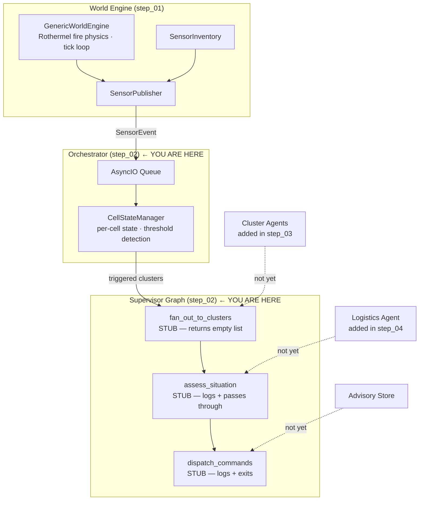
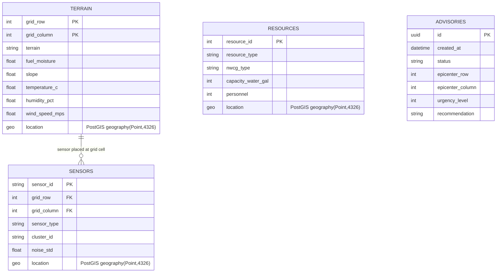

# Wildfire Agentic Advisor — Step 02: Supervisor Graph + Orchestrator Skeleton

> **Step 2 of 9** — The main LangGraph pipeline wired end-to-end for the first time. All nodes are passthrough stubs.

## This Step

Step 02 introduces the `RuntimeOrchestrator` and the `SupervisorGraph`. The world engine from step 01 is now connected to a real LangGraph pipeline — but every node in that pipeline is a stub that logs and passes state through unchanged. The value here is getting the wiring right before adding any intelligence.

### What was added

| Module | Purpose |
|--------|---------|
| `src/runtime/orchestrator.py` | `RuntimeOrchestrator` — consumes `SensorEventQueue`, drives `CellStateManager`, invokes supervisor on threshold crossings |
| `src/agents/supervisor/graph.py` | `build_supervisor_graph()` — compiles the supervisor `StateGraph` |
| `src/agents/supervisor/state.py` | `SupervisorState`, `RiskScore`, custom reducers (`max_cluster_score`, `merge_cluster_findings`) |
| `src/agents/supervisor/nodes.py` | Stub implementations: `fan_out_to_clusters`, `assess_situation`, `dispatch_commands` |
| `src/agents/commons/` | Shared schemas: `TracedState`, `CellReadings`, `Metric`, `GridPosition`, `CollatedRecordRisk` |
| `main.py` | Entry point — wires engine + orchestrator + supervisor, starts the async event loop |

### What you can run

```bash
uv run python verify_setup.py
uv run python main.py              # full pipeline — stub outputs only
uv run python -m pytest tests/ -v
```

The pipeline runs end-to-end. The supervisor is invoked whenever `CellStateManager` detects a threshold crossing. `fan_out_to_clusters` returns an empty `Send` list (no cluster agents yet), `assess_situation` logs the empty findings, and `dispatch_commands` logs and exits.

### Key design points

- **`CellStateManager`** is the threshold gate between raw sensor events and the graph. It maintains per-cell running state and only triggers the supervisor when readings cross configured thresholds — preventing the graph from being invoked on every tick.
- **`SupervisorState` reducers** — `max_cluster_score` and `merge_cluster_findings` are defined now even though cluster agents don't exist yet. They must be in place before the Send API fan-out is added in step 03 because LangGraph resolves the state schema at compile time.
- **`TracedState`** — the base class for all agent states. Carries `session_id`, `status`, and `error`. The `@node_executor` decorator (step 05) requires this contract; establishing it now means step 05 is a drop-in.

---

## Full System Overview



### Data Model



## Step Progression

| Step | What it adds |
|------|--------------|
| 01 | World engine, sensor inventory, publisher, transport queue, store backends |
| **02** | **Supervisor graph + orchestrator skeleton — pipeline wired, all nodes stub** |
| 03 | Cluster (risk) agent skeleton + Send API fan-out |
| 04 | Logistics agent skeleton |
| 05 | `@node_executor` decorator — metrics + exception handling |
| 06 | Jinja2 prompt registry |
| 07 | LLM registry + cluster agent live |
| 08 | Logistics tools + logistics agent live |
| 09 | Advisory dispatch completed — full pipeline operational |
