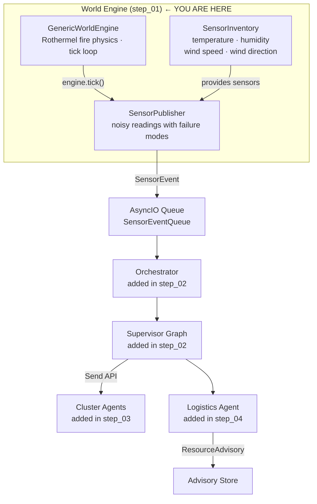
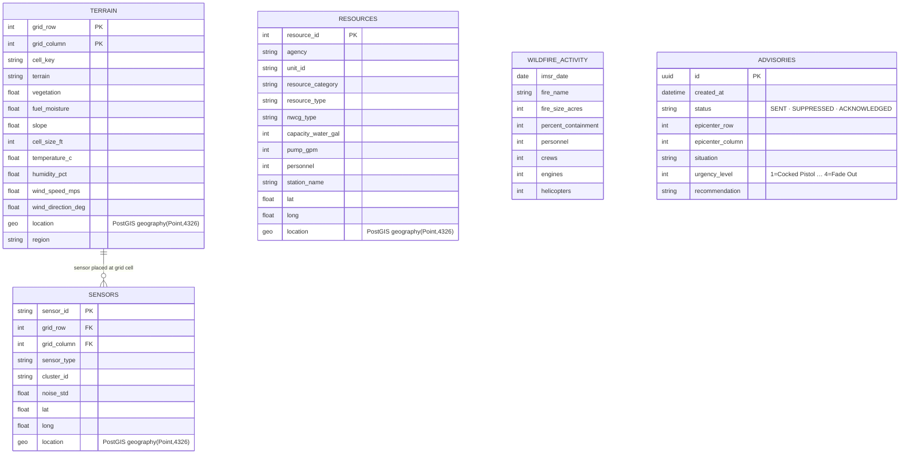

# Wildfire Agentic Advisor — Step 01: World Engine

> **Step 1 of 9** — The pre-built foundation. Later steps do not touch this layer.

## This Step

Step 01 delivers the world simulation engine and data store layer that every subsequent step builds on. There are no agents or LLM calls here — this is the ground truth the agents will reason about.

### What was added

| Module | Purpose |
|--------|---------|
| `src/world/generic_engine.py` | `GenericWorldEngine` — tick loop, drives all physics modules |
| `src/world/generic_grid.py` | `GenericTerrainGrid` — 2D cell grid, 8-connected adjacency |
| `src/world/domains/wildfire/` | Wildfire domain: `FireCellState`, Rothermel physics, fuel models, environment, scenarios |
| `src/world/sensors/` | `SensorBase` subclasses (temperature, humidity, wind); noisy `emit()` with configurable `noise_std` and failure modes |
| `src/world/sensor_inventory.py` | `SensorInventory` — manages all sensors registered to a scenario |
| `src/world/sensors/publisher.py` | `SensorPublisher` — drives `engine.tick()` per cycle, emits `SensorEvent` objects |
| `src/world/transport/` | `SensorEventQueue` (asyncio) — decoupled producer/consumer bridge |
| `src/world/resources/` | `ResourceBase`, `ResourceInventory` — NWCG suppression resource models |
| `src/stores/` | `DataStore` interface + PostgreSQL (PostGIS) and in-memory mock implementations |

### What you can run

```bash
uv run python verify_setup.py        # confirm environment
uv run python -m pytest tests/ -v    # world engine unit tests
```

The world engine is not yet connected to any agent pipeline. You can exercise it directly by importing `GenericWorldEngine` and calling `engine.tick()` to observe the Rothermel physics simulation advancing.

### Key design points

- **Rothermel physics** (`rothermel_physics.py`) computes rate-of-spread, fire intensity, and danger rating per cell based on fuel moisture, slope, and wind. This is what makes the sensor readings non-trivial for an LLM to assess — they reflect real fire behavior.
- **Sensor noise** — each sensor type adds Gaussian noise scaled by `noise_std` and can enter a failure state. The agents in later steps must reason under this uncertainty.
- **Dual-backend stores** — `stores/mock/` provides fully in-memory implementations of all repositories. Switch to `stores/postgres/` when you have a PostGIS database available. The `DataStore` interface is identical either way.

---

## Full System Overview

The diagram below shows where this step fits in the complete pipeline.



### Data Model



## Step Progression

| Step | What it adds |
|------|--------------|
| **01** | **World engine, sensor inventory, publisher, transport queue, store backends** |
| 02 | Supervisor graph + orchestrator skeleton |
| 03 | Cluster (risk) agent skeleton + Send API fan-out |
| 04 | Logistics agent skeleton |
| 05 | `@node_executor` decorator — metrics + exception handling |
| 06 | Jinja2 prompt registry |
| 07 | LLM registry + cluster agent live |
| 08 | Logistics tools + logistics agent live |
| 09 | Advisory dispatch completed — full pipeline operational |
