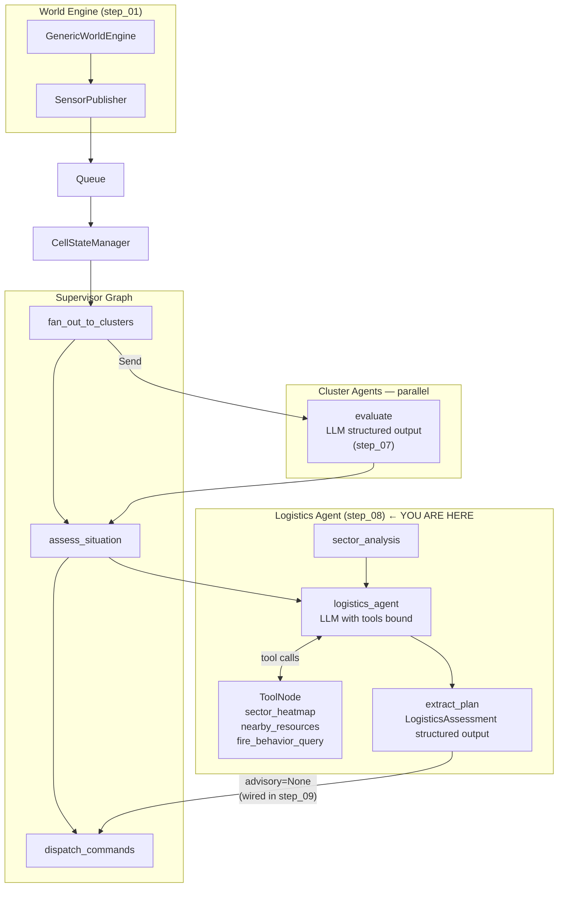

# Wildfire Agentic Advisor — Step 08: Logistics Tools + Logistics Agent Live

> **Step 8 of 9** — The ReAct loop runs. The logistics agent calls tools, reasons over results, and produces a structured deployment assessment.

## This Step

Step 08 completes the logistics agent. Three domain tools are implemented and bound to the agent's LLM, and the `logistics_agent → tools → extract_plan` ReAct loop makes real LLM calls. For the first time the system produces a `LogisticsAssessment` — a structured reasoning trace with observations, data gaps, and an optional `ResourceAdvisory`.

### What was added

| Module | Purpose |
|--------|---------|
| `src/tools/resources.py` | `nearby_resources(lat, lon, radius_miles)` — queries the resource store for NWCG suppression assets within range of a grid position |
| `src/tools/wildfires.py` | `fire_behavior_query(row, col)` — returns Rothermel rate-of-spread, fire intensity, and danger rating for a cell from the world grid; `sector_heatmap(cluster_id)` — returns a risk score grid for an entire cluster |
| `src/agents/logistics/nodes.py` | `logistics_agent` goes live — LLM with tools bound, ReAct loop; `extract_plan` goes live — second LLM call with `LogisticsAssessment` structured output |
| `src/agents/logistics/graph.py` | Updated — `ToolNode` wired with real tool implementations; conditional edge routes on tool calls vs. final response |
| `src/agents/logistics/state.py` | `sector_analysis` field added — written by a new `sector_analysis` node before the ReAct loop |
| `src/llm/llm_registry.py` | Updated — logistics roles (`"logistics"`, `"logistics_extract"`) added to role config |
| `src/prompts/templates/logistics/v1/` | Jinja2 template for the main logistics ReAct prompt |
| `src/prompts/templates/logistics_extract/v1/` | Jinja2 template for the structured extraction step |

### What you can run

```bash
uv run python verify_api_key.py
uv run python verify_llm_registry.py
uv run python main.py              # full LLM pipeline — cluster + logistics agents live
uv run python -m pytest tests/ -v
```

The advisory field on `LogisticsAssessment` will be `None` in this step — the `dispatch_advisory` function exists but is not called yet. That is wired in step 09.

### The ReAct loop in detail

```
logistics_agent node
  ├── receives: situation_summary + cluster_findings + sector_analysis
  ├── renders prompt via PromptRegistry
  ├── calls LLM with tools bound (sector_heatmap, nearby_resources, fire_behavior_query)
  │
  ├── if LLM returns tool calls → ToolNode executes them → back to logistics_agent
  └── if LLM returns final response → extract_plan node
        └── second LLM call with LogisticsAssessment structured output schema
              → observations, data_gaps, assessment, advisory_rationale, advisory?
```

### Key design points

- **Two-phase logistics** — the ReAct loop and the structured extraction are separate LLM calls. The ReAct loop uses a conversational model with tools; extraction uses `.with_structured_output(LogisticsAssessment)`. Separating them avoids forcing the ReAct model to produce valid JSON mid-reasoning and keeps the output schema validation clean.
- **`data_gaps` as a branch signal** — `LogisticsAssessment.data_gaps` is intentionally a list, not a boolean. Non-empty means the agent identified something it could not find (e.g., "No available resources found within 30 miles of hotspot (2,3)"). Downstream logic can branch on this — retry with a wider radius, escalate to a human, or log for later.
- **Tool grounding** — `fire_behavior_query` reads directly from the in-memory world grid rather than calling an external service. This means the LLM's tool results are always consistent with the simulator's current state, not cached or approximated.

---

## Full System Overview



## Step Progression

| Step | What it adds |
|------|--------------|
| 01 | World engine, sensor inventory, publisher, transport queue, store backends |
| 02 | Supervisor graph + orchestrator skeleton |
| 03 | Cluster (risk) agent skeleton + Send API fan-out |
| 04 | Logistics agent skeleton |
| 05 | `@node_executor` decorator — metrics + exception handling |
| 06 | Jinja2 prompt registry |
| 07 | LLM registry + cluster agent live |
| **08** | **Logistics tools + logistics agent live — ReAct loop with real tool calls and structured extraction** |
| 09 | Advisory dispatch completed — full pipeline operational |
