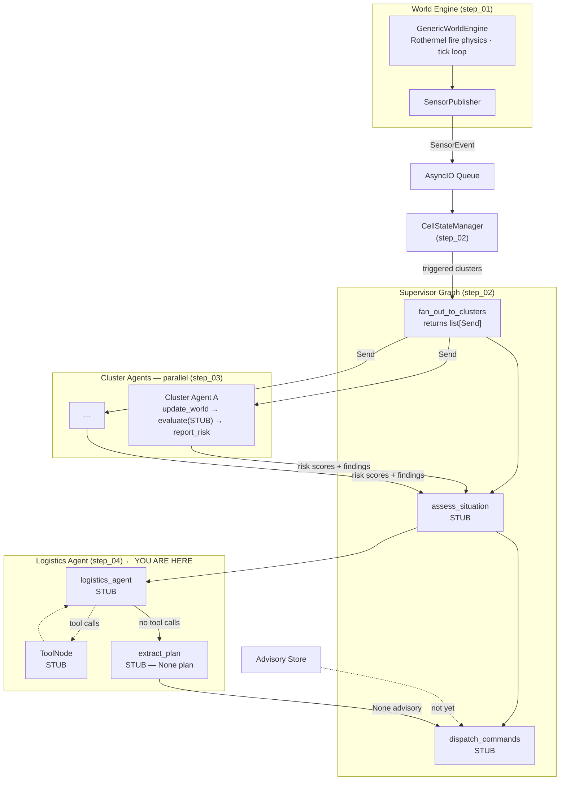

# Wildfire Agentic Advisor — Step 04: Logistics Agent Skeleton

> **Step 4 of 9** — The third graph. The supervisor now has all three subgraphs wired, all as stubs.

## This Step

Step 04 adds the logistics agent — the second subgraph and the first ReAct-style loop in the pipeline. The supervisor invokes it after `assess_situation` to determine what suppression resources should be deployed. At this stage the logistics agent is a complete stub: the graph topology, state schema, and tool placeholders are in place, but no real tool calls or LLM calls happen.

After this step all three graphs (supervisor, cluster agents, logistics agent) are wired together. Steps 05–09 add intelligence to this skeleton.

### What was added

| Module | Purpose |
|--------|---------|
| `src/agents/logistics/graph.py` | `build_logistics_agent_graph()` — compiles the ReAct subgraph |
| `src/agents/logistics/state.py` | `LogisticsAgentState` — `situation_summary`, `cluster_findings`, `sector_analysis`, `messages`, `logistics_plan`, `logistics_assessment` |
| `src/agents/logistics/nodes.py` | `logistics_agent` (STUB), `tools` placeholder (STUB), `extract_plan` (STUB — returns empty assessment) |
| `src/agents/supervisor/graph.py` | Updated to compile logistics subgraph alongside cluster subgraph |
| `src/agents/supervisor/nodes.py` | `make_run_logistics_agent` — maps supervisor state into `LogisticsAgentState`, invokes subgraph, lifts `logistics_plan` back |
| `src/agents/supervisor/state.py` | `logistics_plan: str | None` field added |

### What you can run

```bash
uv run python verify_setup.py
uv run python main.py              # full three-graph pipeline (all stubs)
uv run python -m pytest tests/ -v
```

All three graphs now execute on each supervisor invocation. The logistics agent receives the situation summary and cluster findings, logs them, and returns a `None` plan. The supervisor logs the empty plan and dispatches nothing.

### Key design points

- **ReAct topology** — the logistics graph follows the standard `agent → tools → agent` loop pattern. The conditional edge after `logistics_agent` routes to `tools` if the LLM returned tool calls, or to `extract_plan` if it returned a final response. At stub stage, `logistics_agent` always returns a final response immediately, so `tools` never runs.
- **`LogisticsAssessment`** — the structured output schema that `extract_plan` will eventually populate. It separates `observations` (factual findings from tool results), `data_gaps` (missing inputs), `assessment` (reasoning), and an optional `ResourceAdvisory`. Defining it now means the LLM extraction step in step 08 can be added without changing the state schema.
- **Subgraph composition** — `build_supervisor_graph` builds both the cluster and logistics subgraphs internally and threads `AgentDependencies` (stores + registries) down into each. Callers configure dependencies once at the composition root.

---

## Full System Overview



## Step Progression

| Step | What it adds |
|------|--------------|
| 01 | World engine, sensor inventory, publisher, transport queue, store backends |
| 02 | Supervisor graph + orchestrator skeleton |
| 03 | Cluster (risk) agent skeleton + Send API fan-out |
| **04** | **Logistics agent skeleton — all three graphs wired, all stubs** |
| 05 | `@node_executor` decorator — metrics + exception handling |
| 06 | Jinja2 prompt registry |
| 07 | LLM registry + cluster agent live |
| 08 | Logistics tools + logistics agent live |
| 09 | Advisory dispatch completed — full pipeline operational |
