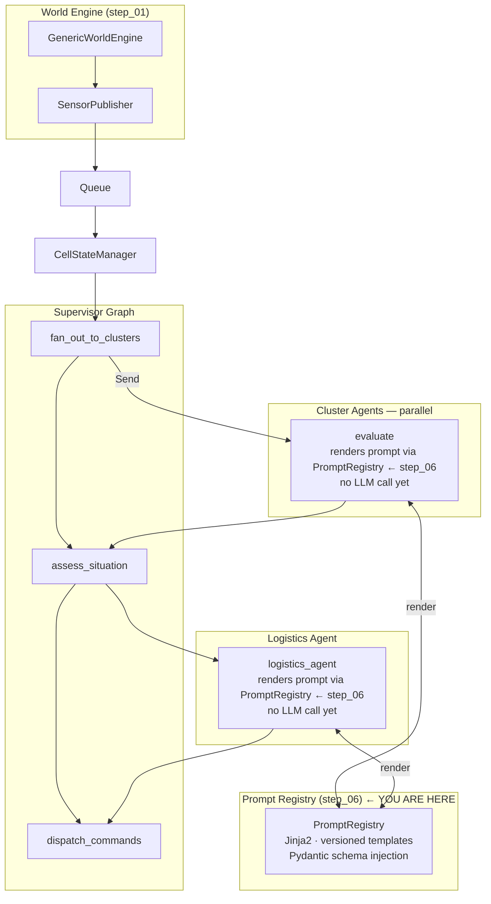

# Wildfire Agentic Advisor — Step 06: Jinja2 Prompt Registry

> **Step 6 of 9** — All prompt strings move out of code and into versioned templates. Agent nodes never construct prompt strings directly.

## This Step

Step 06 introduces the `PromptRegistry` — a Jinja2-backed loader that renders versioned prompt templates and injects Pydantic model schemas on demand. Agent nodes that will call LLMs in steps 07 and 08 now retrieve their prompts from the registry rather than building strings in code. This step does not add LLM calls — it prepares the prompt infrastructure so that step 07 is a clean, isolated change.

### What was added

| Module | Purpose |
|--------|---------|
| `src/prompts/registry.py` | `PromptRegistry` — discovers templates under `prompts/templates/`, renders via Jinja2 `StrictUndefined`, validates required variables, injects Pydantic model schemas via a custom `schema` filter |
| `src/prompts/templates/` | Template tree: `<prompt_name>/<version>/prompt.j2` + `manifest.yaml` (required_vars + description) |
| `src/agents/commons/agent_dependencies.py` | Updated — `PromptRegistry` added to the `AgentDependencies` container threaded through all graphs |
| `src/agents/cluster/nodes.py` | Cluster `evaluate` node now calls `registry.render(...)` to build its (still-unused) prompt |
| `src/agents/logistics/nodes.py` | Logistics nodes now call `registry.render(...)` to build their (still-unused) prompts |
| `src/agents/cluster/graph.py` | Updated to accept and thread `AgentDependencies` |
| `src/agents/logistics/graph.py` | Updated to accept and thread `AgentDependencies` |

### What you can run

```bash
uv run python verify_setup.py
uv run python main.py              # same pipeline — registry validates all templates at startup
uv run python -m pytest tests/ -v
```

A misconfigured template (missing required variable, unknown schema name) raises `PromptError` at startup, not at first use. This means prompt bugs surface in CI rather than in production under load.

### Template layout

```
src/prompts/templates/
  cluster_evaluate/
    v1/
      prompt.j2       ← Jinja2 template
      manifest.yaml   ← required_vars, description
  logistics/
    v1/
      prompt.j2
      manifest.yaml
  logistics_extract/
    v1/
      prompt.j2
      manifest.yaml
```

Versions are resolved lexicographically — the registry loads the latest version by default. To pin a node to an older version, pass `version="v1"` explicitly to `registry.render()`.

### Key design points

- **Dependency direction** — `prompts/` never imports from `agents/`. Agent nodes import the registry and register their Pydantic models against it. The schema filter (`{{ ModelName | schema }}`) renders the model's JSON schema inline into the template, giving the LLM a machine-readable output spec without the agent code knowing what the template contains.
- **`StrictUndefined`** — Jinja2's strict mode ensures that a template referencing a variable not passed to `render()` raises immediately rather than silently rendering an empty string. Combined with `manifest.yaml` validation, it is impossible to render a prompt with a missing variable.
- **Fail loudly** — the registry has no silent fallbacks. A missing template, a missing variable, or an unknown schema name all raise `PromptError` with a clear message.

---

## Full System Overview



## Step Progression

| Step | What it adds |
|------|--------------|
| 01 | World engine, sensor inventory, publisher, transport queue, store backends |
| 02 | Supervisor graph + orchestrator skeleton |
| 03 | Cluster (risk) agent skeleton + Send API fan-out |
| 04 | Logistics agent skeleton |
| 05 | `@node_executor` decorator — metrics + exception handling |
| **06** | **Jinja2 prompt registry — versioned templates, schema injection, fail-loud validation** |
| 07 | LLM registry + cluster agent live |
| 08 | Logistics tools + logistics agent live |
| 09 | Advisory dispatch completed — full pipeline operational |
