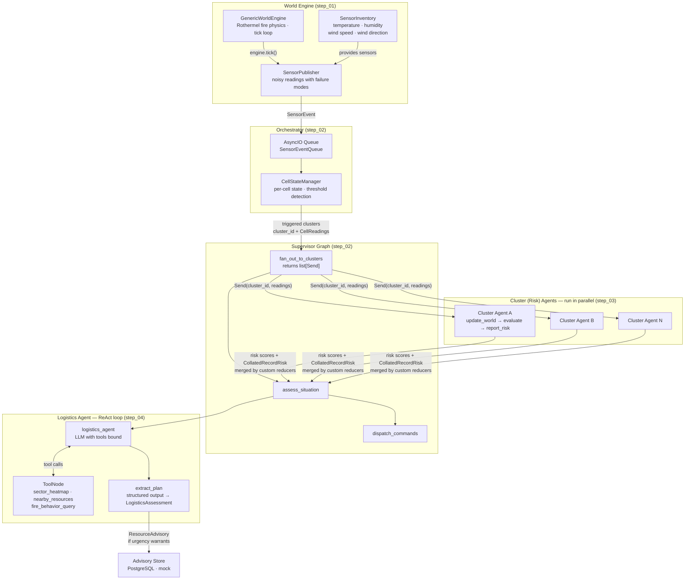
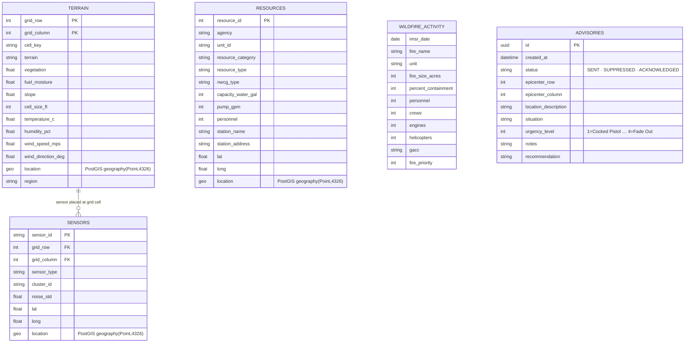

# Wildfire Agentic Advisor — Tutorial

A step-by-step tutorial for building a production-grade multi-agent AI application using [LangGraph](https://github.com/langchain-ai/langgraph). Each numbered directory is a self-contained, runnable checkpoint. Start at `step_01` and work forward, or jump directly to any step to see the system at that stage of development.

---

## What We Are Building

The application is a wildfire early-warning and resource advisory system. A physics-based world simulator continuously generates sensor telemetry across a geo-gridded terrain. An agentic pipeline consumes that telemetry, assesses fire risk using parallel LLM agents, evaluates nearby suppression resources, and issues a structured advisory when conditions warrant a response.

The wildfire domain is the vehicle — the engineering patterns are the point. After completing all nine steps you will have implemented from scratch:

- A **supervisor / worker** multi-agent hierarchy with a LangGraph `StateGraph` at each level
- **Parallel subgraph fan-out** using LangGraph's Send API with custom state reducers as the synchronisation barrier
- A **ReAct tool-calling loop** with domain-specific tools and structured output extraction
- A **node decorator** providing cross-cutting metrics, exception capture, and distributed tracing for every graph node
- A **versioned Jinja2 prompt registry** fully decoupled from agent code
- A **role-based LLM registry** for routing different roles to different providers and models
- A **dual-backend data store** (PostgreSQL with PostGIS + in-memory mock) behind a shared interface

---

## System Architecture

### Runtime Data Flow



### Data Model

The world state and agent outputs are persisted through a store layer with both a PostgreSQL (PostGIS) implementation and an in-memory mock for testing.



---

## Step Progression

Each directory is a standalone runnable project. The table shows exactly what each step adds over the previous one.

| branch   | Directory | What it adds                                                                                                                                                                                    |
|----------|-----------|-------------------------------------------------------------------------------------------------------------------------------------------------------------------------------------------------|
| step_01  | `agentic-simulator-step_01` | **World engine** — Rothermel fire physics, terrain grid, wildfire domain cell states, sensor inventory, `SensorPublisher`, `SensorEventQueue`, PostgreSQL + mock store backends                 |
| step_02  | `agentic-simulator-step_02` | **Supervisor graph + orchestrator skeleton** — `RuntimeOrchestrator` wires publisher → queue → `CellStateManager` → supervisor; all graph nodes are passthrough stubs                           |
| step_03  | `agentic-simulator-step_03` | **Cluster (risk) agent skeleton** — `ClusterAgentState`, `update_world → evaluate → report_risk` subgraph; supervisor fans out via Send API; `evaluate` returns deterministic stub scores       |
| step_04  | `agentic-simulator-step_04` | **Logistics agent skeleton** — `LogisticsAgentState`, `logistics_agent → tools → extract_plan` subgraph wired into the supervisor after `assess_situation`                                      |
| step_05  | `agentic-simulator-step_05` | **`@node_executor` decorator** — wraps all node functions with per-node timing, structured exception capture, and `session_id` tracing; `TracedState` base class added                          |
| step_06  | `agentic-simulator-step_06` | **Jinja2 prompt registry** — `PromptRegistry` loads versioned templates from `prompts/templates/<name>/<version>/prompt.j2`; all agent nodes switch to rendered prompts                         |
| step_07  | `agentic-simulator-step_07` | **LLM registry + cluster agent live** — `LLMRegistry` routes roles to providers (STUB / OpenAI / Anthropic / Ollama); cluster agent `evaluate` node makes real structured-output LLM calls      |
| step_08  | `agentic-simulator-step_08` | **Logistics tools + logistics agent live** — `sector_heatmap`, `nearby_resources`, `fire_behavior_query` tools implemented; logistics ReAct loop makes real LLM calls; prompt templates added   |
| step_09  | `agentic-simulator-step_09` | **Advisory dispatch completed** — `dispatch_advisory` writes `ResourceAdvisory` to the advisory store; logistics prompts refined; full end-to-end pipeline operational                          |

---

## Prerequisites

- Python 3.11+
- [`uv`](https://github.com/astral-sh/uv) for environment management
- An API key for your chosen LLM provider (steps 07–09 only; steps 01–06 run without one)
- PostgreSQL with PostGIS (optional — every step includes an in-memory mock backend)

```bash
cd agentic-simulator-step_01   # or whichever step you want
uv sync
uv run python verify_setup.py
```

Steps 07 and later also include `verify_llm_registry.py` and `verify_api_key.py` to confirm your LLM configuration before running the full pipeline.
